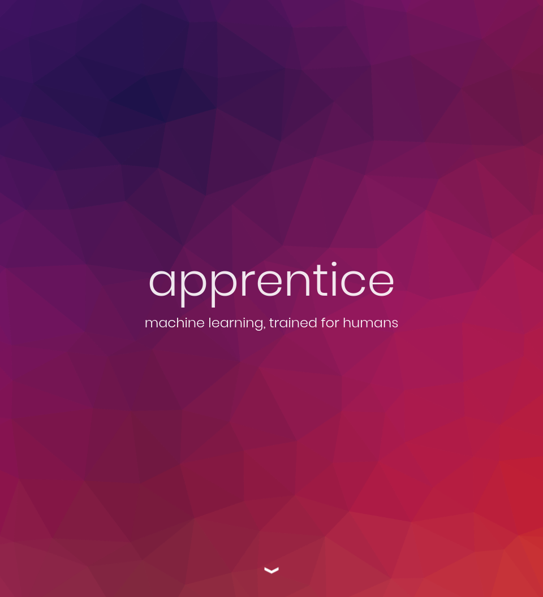
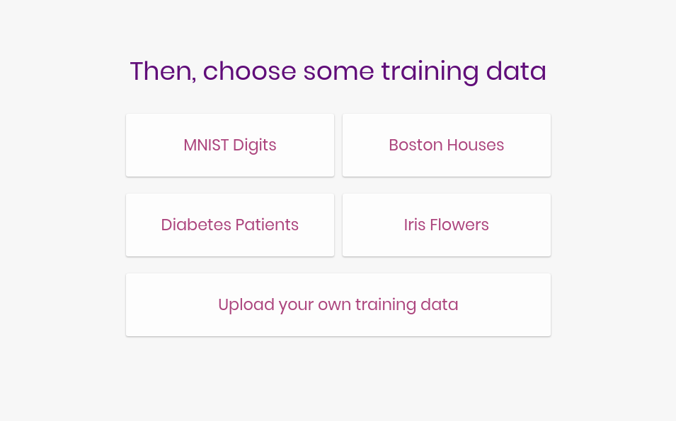
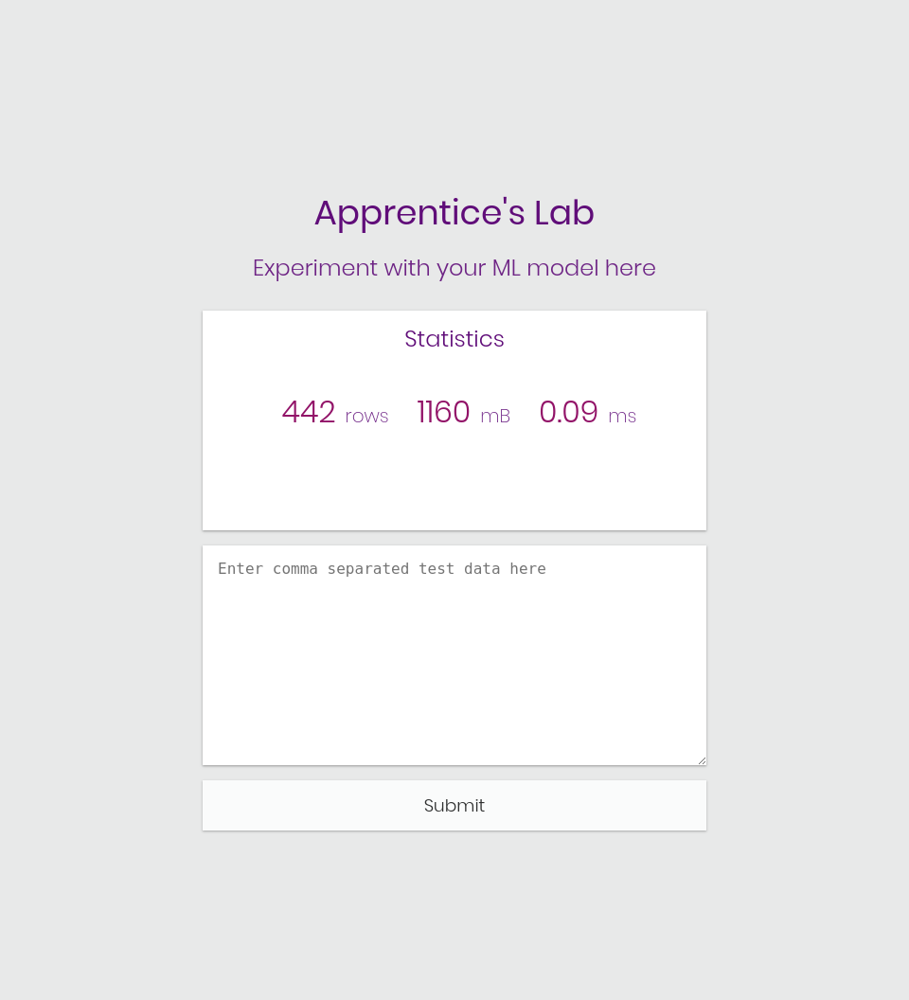

# Apprentice: Machine Learning made Accessible

Machine learning sandbox using React and Flask. Built at HackMIT 2017







# Running Apprentice

## 1. [Install MongoDB](https://docs.mongodb.com/v3.2/administration/install-community/)

### Start the mongo server
`sudo service mongod start`

### Create a db called apprentice
```
mongo
> use apprentice
> db.users.insert({})
```

## 2. Start the Flask API
```
cd api
export FLASK_APP=app.py
flask run &
```

## 3. Start the application
```
cd app
npm install
npm start
```

The application will run on `localhost:3000`

# API

### POST /upload
Uploads a custom dataset
```python
  {
    "files":[(X, ...), (y, ...)],
    "predict": <id if uploading predict dataset>/null
  }
```

### POST /example
Specifies an existing example dataset
```python
{
  "example": "iris"
}
```

### POST /fit
Fits the specified learner on the chosen datset
```python
  {
    "data": {
      "id": <id>,
      "algorithm":["svm", {<params>}]
    }
  }
```

### POST /predict
Generates a prediction using input
```python
  {
    "id":<id of orig dataset>
  }
```
